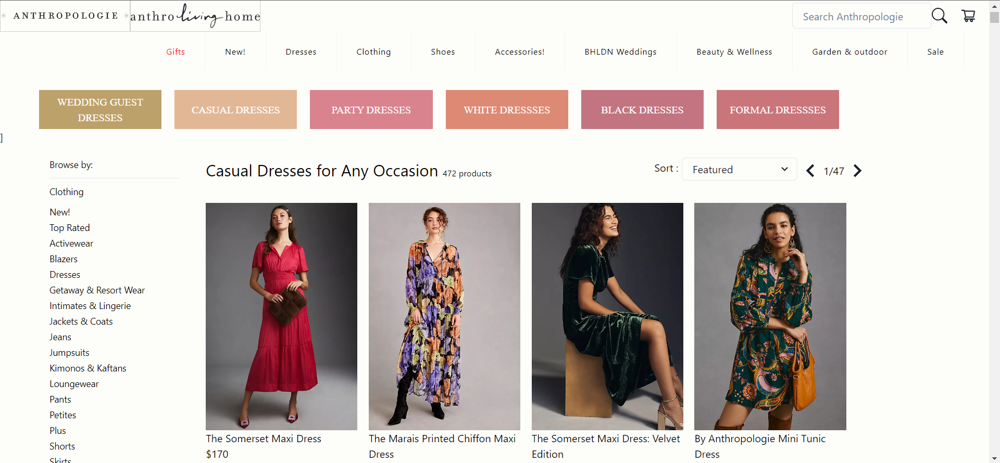
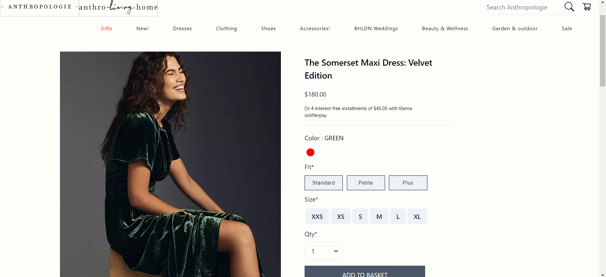
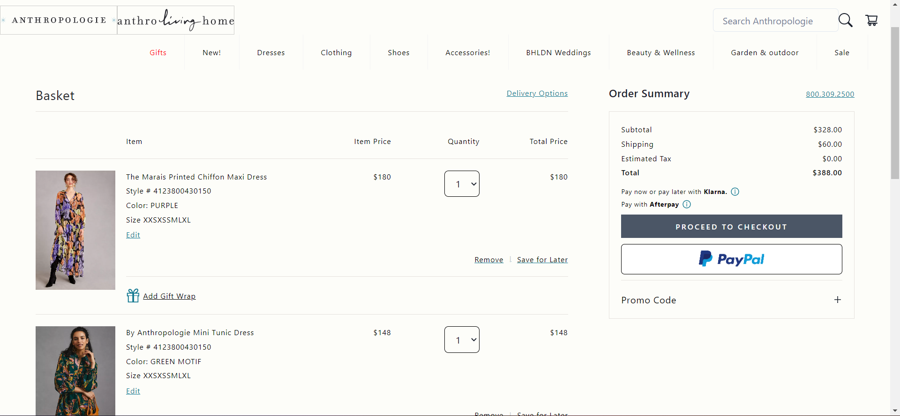

# Anthropologie (Clone)

Anthropologie is a unique, full-lifestyle shopping destination, with a mostly exclusive assortment of clothing, shoes, accessories, beauty, furniture, home décor, garden, bridal, and more.

## Have a Look 😍
### Navbar and Home Page
<p align="center">
  
</p>

### Product Page
<p align="center">
  
</p>

### Single Page of the Product
<p align="center">
  
</p>

### Cart Product Page
<p align="center">
  
</p>

### Payment page
<p align="center">
  
</p>

### Vercel Link 
https://anthropologie-pandit0305.vercel.app/

### Netlify   Link
https://leafy-buttercream-cd6899.netlify.app/

## Collaborators
1. [Khalid Shah - Team Lead](https://github.com/Khalidshah12/) 
*  Cart Page 
*  Address Page 
*  Review Page 
*  Payment Page
*  
2. [Pandit Gangadhar - Team Member](https://github.com/pandit0305)
*  Products Page
*  Single Product Page
*  Signup & Login
*  Collecting Data
*  
3. [Sohil Khan - Team Member](https://github.com/sohilweb20)
*  Navbar Section
*  Home Page
*  Footer Section

## Features
*  Login/Signup using Firebase.
*  Different Categories and Sections.
*  Add to Cart.
*  Can View Similar Products.
*  Can Increase the Quantity of the Cart Items.
*  Address Validation & Credit Card Validation
*  Responsive Design

## Tech Stacks
```
React | React-Router-Dom | Redux | React-Redux | Redux-Thunk | React-Firebase-Hooks | React-Scripts | React-Scroll | React-Slick | React-Icon | React-Bootstrap | Bootstrap | Chakra | Chakra-Icon | Slick-Carousel | Web-Vitals
```

### Getting Started

These instructions will get you a copy of the project up and running on your local machine for development and testing purposes.

### Prerequisites

Npm / Yarn and Node.js installed

### Installation

Installing NPM modules
Execute these commands from the project directory

```
npm install
```

### Running the app

Open a terminal on directory

```
npm run start
```

Access the web app at http://localhost:3000/
